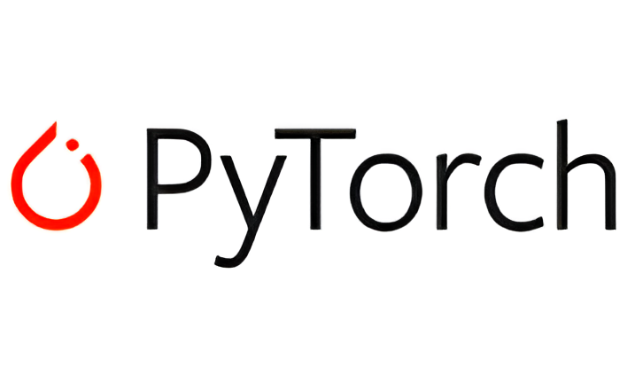
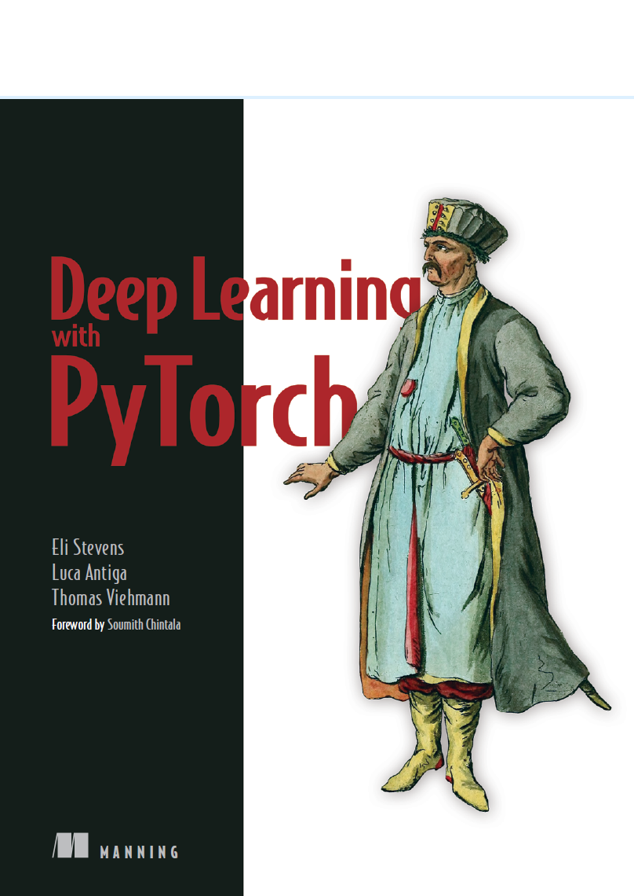

  
<!--   --->

# Machine Learning e Data Science 

Repositório criado para adicionar estudos e conteúdos práticos referentes a Machine Learning e Data Science 

# Estudos 🔥🤖

## PyTorch Documentation 

<b>Material disponível em:</b> [PyTorch Official Documentation](https://docs.pytorch.org/tutorials/beginner/basics/intro.html)

<b>Tópicos:</b>

- ✔️ Quickstart
- ✔️ Tensors
- ✔️ Datasets & DataLoaders
- ✔️ Transforms
- ✔️ Build the Neural Network
- ✔️ Automatic Differentiation with torch.autograd
- ✔️ Optimizing Model Parameters

## Livro: Deep Learning with PyTorch

<b>Autores:</b> Eli Stevens, Luca Antiga, Thomas Viehmann

- ❗Introducing depp learning and the PyTorch Libray
- ❗Pretrained networks
- ❗It starts with a tensor
- ❗Real-world data representation using tensors
- ❗The mechanics of learning
- ❗Using a neural network to fit the data
- ❗Telling birds from airplanes: Learning from images
- ❗Using convolutions to generalize
- ❗Using PyTorch to fight cancer
- ❗Combining data sources into a unified dataset
- ❗Training a classification model to detect suspected tumors
- ❗Improving training with metrics and augmentation
- ❗Using segmentation to find suspected modules
- ❗End-to-end module analysis, and where to go next
- ❗Deploying to production

## Optuna Documentation

<b>Material disponível em:</b> [Optuna Official Documentation](https://optuna.readthedocs.io/en/stable/tutorial/index.html)

- ❗Lightweight, versatile and platform agnostic architecture
- ❗Pythonic Search Space
- ❗Efficient Optimization Algorithms
- ❗Easy Parallelization
- ❗Quick Visualization for Hyperparameter Optimization Analysis

<!---
## Exercícios

Níveis de dificuldades dos exercícios:

* Fácil: 🟢
* Trabalhoso: 🟡
* Médio: :orange_circle:
* Díficil: :red_circle:

⏳ **Penguins vs Turtles - Image Classification** 🟢

Dataset retirado do [Kaggle](https://www.kaggle.com/datasets/abbymorgan/penguins-vs-turtles)
* Disponível em: [Repositório]()

⏳ **Head Gesture Recognition with Capacitive Sensors - Classification** 🟡

Dataset retirado do [Kaggle](https://www.kaggle.com/datasets/ionutcristianseverin/headgesture-recognition-with-capacitive-sensors)

* Métodos utilizados:
1. KNN (72,95%) | 

* Disponível em: [Repositorio](https://github.com/LuizGustavoVTacin/MachineLearning/tree/main/Exercicios/HeadGestureRecognition)

⏳ **Water Potability - Classification** 🟡

Dataset retirado do [Kaggle](https://www.kaggle.com/datasets/adityakadiwal/water-potability)

* Métodos utilizados:
1. 

⏳ **Stroke Prediction - Classification** 🟡

Dataset retirado do [Kaggle](https://www.kaggle.com/datasets/fedesoriano/stroke-prediction-dataset)

* Métodos utilizados:
1.

⏳ **Heart attack possibility - Classification** 🟢

Dataset retirado do [Kaggle](https://www.kaggle.com/datasets/nareshbhat/health-care-data-set-on-heart-attack-possibility)

* Métodos utilizados:
1. KNN (81.97%) | (88,52% - Hiperparâmetros) - MELHORAR

* Disponível em: [Repositorio](https://github.com/LuizGustavoVTacin/MachineLearning/tree/main/Exercicios/HeartAttackPossibility)

⏳ **Airline Passenger Satisfaction - Classification** 🟢

Dataset retirado do [Kaggle](https://www.kaggle.com/datasets/teejmahal20/airline-passenger-satisfaction)

* Métodos utilizados:
1. Árvore de Decisão (94,62%) - MELHORAR   
2. KNN (92,99%) | (94,00% - Hiperparâmetros) - MELHORAR
3. SVM 

* Disponível em: [Repositorio](https://github.com/LuizGustavoVTacin/MachineLearning/tree/main/Exercicios/AirlinePassengerSatisfaction)

**To ADD** --->
